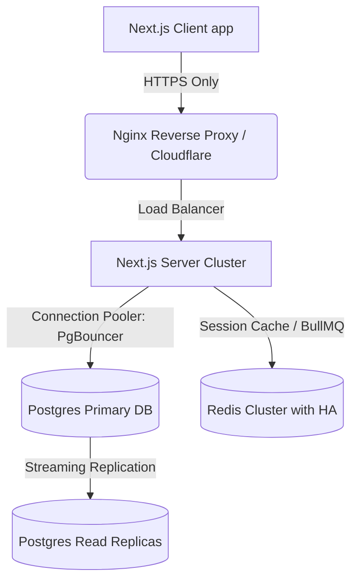

# สรุปหนี้ทางเทคนิคและงานคงค้าง (Tech Debt & Backlog)

เอกสารนี้รวบรวมข้อจำกัดทางเทคนิค ปัญหาเชิงสถาปัตยกรรม (Tech Debt) รายการฟีเจอร์คงค้าง (Backlog) และแนวทางการนำระบบขึ้นสู่สภาวะใช้งานจริงในอนาคต (Production Roadmap)

---

## 1. หนี้ทางเทคนิคปัจจุบัน (Current Technical Debt)

### 1.1 การรองรับ Next.js 15 และ React 19

- **ปัญหา:** React 19 มีการรีเซ็ตฟิลด์ของ Uncontrolled Inputs หลังจาก Server Action ทำงานสำเร็จ ซึ่งในบางฟอร์มที่ต้องการกรอกข้อมูลติดต่อกันหลายครั้ง (เช่น POS หรือสินค้าสต๊อก) อาจสร้างความสับสนได้
- **แนวทางแก้ไข:** ควรเปลี่ยนอินพุตหลักๆ ในระบบเป็นแบบ Controlled Component หรือใช้ React state ควบคุมแทนการดึงจาก `FormData` โดยตรง

### 1.2 การใช้งาน Library `otplib` เวอร์ชัน 13

- **ปัญหา:** `otplib` v13 มีการเปลี่ยนโครงสร้าง API จากเดิมที่เป็น Synchronous Export เป็นรูปแบบ Asynchronous Top-level (`generate`/`verify`/`generateSecret`) ซึ่งโค้ดปัจจุบันในบางจุดยังใช้โครงสร้างโมดูลจำลอง
- **แนวทางแก้ไข:** ควรอัปเดตคลาส/บริการ TOTP ให้สอดคล้องกับ API ใหม่ของ otplib ครบถ้วน เพื่อความปลอดภัยระดับสูงเมื่อเปิดใช้ 2FA

### 1.3 ระบบจัดการเซสชันแบบแฮนด์โรล (Hand-rolled Sessions)

- **ปัญหา:** ระบบใช้การเก็บบันทึกเซสชันลงในตาราง `sessions` ในฐานข้อมูลหลักเพื่อรองรับการยกเลิกเซสชัน (Revoke) ซึ่งส่งผลให้เกิด I/O การคิวรีตารางนี้ในทุก HTTP Request ผ่าน Middleware
- **แนวทางแก้ไข:** ในโปรดักชันควรย้ายตารางเซสชันไปอยู่ใน Redis (ผ่าน Redis Session Store) เพื่อเพิ่มความเร็วในการตรวจสอบสิทธิ์และลดโหลดของ PostgreSQL

---

## 2. รายการคงค้างเพื่อการพัฒนาในรอบถัดไป (Backlog)

### 2.1 ระบบคิวออกรายงานและดาวน์โหลดไฟล์ขนาดใหญ่ (BullMQ Worker)

- **สถานะปัจจุบัน:** หน้าจอสรุปรายงานใน `/admin/accounting/reports` มีเฉพาะการแสดงผลตาราง/KPI บนหน้าจอ ไม่มีปุ่มดาวน์โหลดไฟล์ CSV/Excel/PDF เนื่องจากระบบไม่มีคิวประมวลผลเบื้องหลัง
- **งานถัดไป:** พัฒนา BullMQ Job สำหรับการรันงานออกรายงานขนาดใหญ่ โดยระบบประมวลผลเสร็จแล้วจะส่งการแจ้งเตือนและลิงก์ดาวน์โหลดทางช่องทางแจ้งเตือน

### 2.2 การนำเข้าและเปรียบเทียบสเตทเมนต์ธนาคารอัตโนมัติ (Bank Statement Reconciliation)

- **สถานะปัจจุบัน:** ระบบกระทบยอดบัญชีเงินฝากธนาคารแบบเทียบยอดดุลสะสมรวม ไม่มีการนำเข้าไฟล์ CSV สเตทเมนต์ธนาคารมาจับคู่รายรายการ (Transaction Matching)
- **งานถัดไป:** พัฒนาตัวแปลง (Adapter) สำหรับนำเข้าสเตทเมนต์ของธนาคารไทยหลักๆ (เช่น KBANK, SCB) และใช้ตรรกะ Regex หรือวันที่/เวลาเพื่อทำการ Auto-match ยอดรับโอนเงินหน้าร้าน POS

### 2.3 ระบบอนุมัติแก้ไขราคาทองหน้าบิล POS (Price Override Workflow)

- **สถานะปัจจุบัน:** บิลขายทองจะอ้างอิงราคาตามราคาประกาศร้านค้าแบบอัตโนมัติ ไม่สามารถแก้ราคาแบบระบุตัวเลขเองได้ (Price Override)
- **งานถัดไป:** พัฒนาปุ่มขออนุญาตลดราคา/แก้ราคา โดยจะส่งคำขอไปยังระบบอนุมัติของผู้จัดการสาขาที่อยู่บริเวณนั้น เพื่อทำการสแกนหรือใส่ PIN อนุมัติการลดราคาข้ามขีดจำกัด (Override limit)

---

## 3. แผนการนำระบบขึ้นระบบงานจริง (Production Deployment Roadmap)

เมื่อต้องการเปลี่ยนผ่านระบบ ERP จากการรันแบบ Local Development สู่ระบบ Production จริง มีแนวทางเชิงวิศวกรรมที่จำเป็นต้องปฏิบัติตามดังนี้:

### 3.1 ความปลอดภัยของเครือข่ายและการรับสิทธิ์เซสชัน (SSL/TLS & CSP)

- บังคับการเชื่อมต่อผ่าน **HTTPS Only** ทั่วทั้งระบบ และกำหนดค่าแฟล็กคุกกี้เซสชันเป็น `Secure` และ `SameSite=Strict`
- ตั้งค่าเซิร์ฟเวอร์ Nginx หรือ Cloudflare เพื่อป้อน CSP Header ที่เข้มงวดยิ่งขึ้น และเปิดใช้ระบบป้องกันการโจมตีประเภท DDoS และ WAF (Web Application Firewall)

### 3.2 การขยายขีดความสามารถของฐานข้อมูล (PgBouncer & Replica)

- **PgBouncer:** เนื่องจากแอปพลิเคชัน Next.js เป็นแบบ Serverless หรือ Containerized ที่สเกลได้ง่าย ตัวเชื่อมต่อฐานข้อมูลอาจล้นขีดจำกัด (Max Connections) ได้ง่าย ควรมี PgBouncer คั่นหน้า PostgreSQL เพื่อบริหาร Connection Pool
- **Read/Write Split:** ปรับปรุง Prisma Client ให้เขียนข้อมูลลงฐานข้อมูลหลัก (Primary DB) และกระจายโหลดงานดึงข้อมูลออกรายงานขนาดใหญ่ไปคิวรีจากเครื่องสำเนาข้อมูลแบบอ่านอย่างเดียว (Read Replicas)

### 3.3 ความมั่นคงปลอดภัยระดับเก็บประวัติการตรวจสอบ (Audit Log Vault)

- ปรับโครงสร้างสิทธิ์ผู้ใช้งานฐานข้อมูลของแอปพลิเคชันหลัก (DB User) โดยห้ามไม่ให้สิทธิ์เขียนทับ (UPDATE) หรือลบข้อมูล (DELETE) ในตาราง `audit_logs`
- นำระบบตรวจสอบความปลอดภัย (gitleaks) มาผูกในไปป์ไลน์ CI/CD เพื่อตรวจสอบความปลอดภัยสกัดกั้นไม่ให้คีย์ลับหรือรหัสผ่านรั่วไหลลงไปใน Source Code
